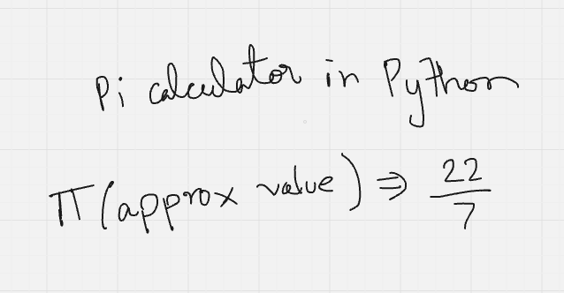
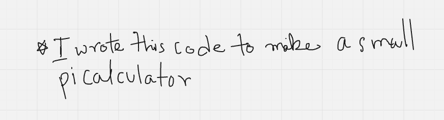
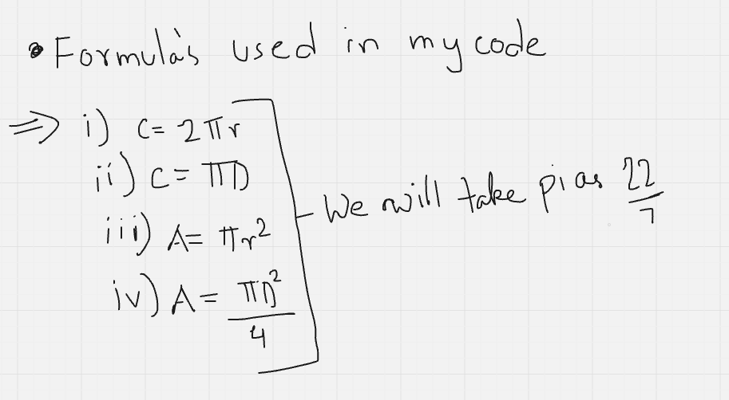
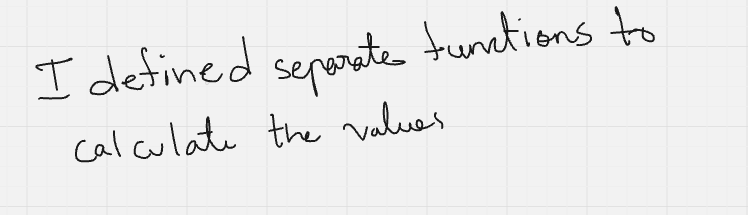

# small-pi-calculator
I wrote a code where u can evaluate the values of circumference or area with pi. I should have been used input function but I directly used print function.

Formulas for circle

##See

